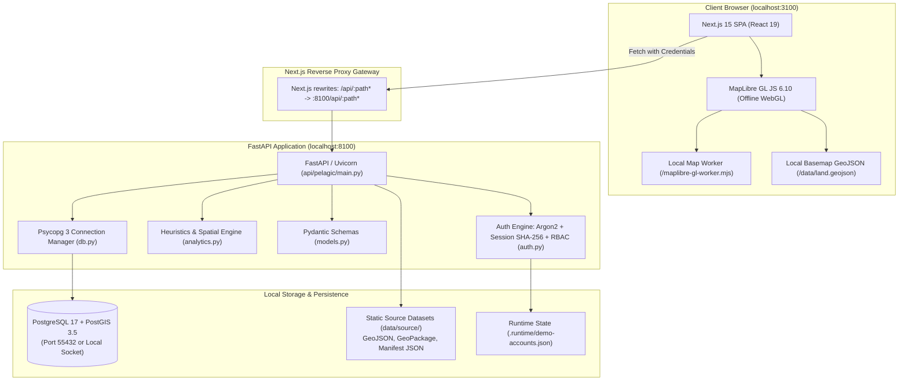

# PALEGIC (SIH 2026 - Problem Statement 26143)
# Current System Architecture Audit

**Project Name:** PALEGIC (PELAGIC)  
**Problem Statement ID:** 26143  
**Problem:** Leveraging satellite imagery to determine oil spills at sea along with AIS data correlations to identify the vessel responsible for the spill.  
**Audit Date:** 2026-09-25  
**Audit Status:** Baseline Prototype Repository Inspection  

---

## 1. System Overview & Architectural Paradigm

PELAGIC v2 is architected as an **evidence-centric, offline-first prototype** designed to run on a local workstation without internet connectivity during demonstrations. It combines a Next.js frontend with MapLibre GL JS, a FastAPI backend service, and a PostgreSQL/PostGIS spatial database.

The system does **not** employ microservices, distributed task queues (Celery/Redis/Kafka), cloud buckets (S3/GCS), or live satellite/AIS ingestion feeds. Instead, all data operations are executed synchronously through a single-process FastAPI application communicating with PostgreSQL/PostGIS.



---

## 2. Technology Stack & Component Versions

### 2.1 Frontend Stack
- **Framework:** Next.js `15.5.0` (App Router architecture, single-route entrypoint at `apps/web/app/page.tsx`).
- **Core Library:** React `19.1.0` and React-DOM `19.1.0`.
- **Language:** TypeScript `5.9.0`.
- **CSS / Styling:** Pure Vanilla CSS (`apps/web/app/globals.css`, 24.6 KB). No TailwindCSS, no CSS Modules, no styled-components.
- **Icons:** `lucide-react` `^0.468.0`.
- **Map Rendering:** `maplibre-gl` `^6.10.0`.
  - Self-hosted worker script cached via `apps/web/scripts/cache-map-worker.mjs` to `apps/web/public/maplibre/maplibre-gl-worker.mjs`.
  - Local vector land polygons loaded from `apps/web/public/data/land.geojson`.
- **Chart Libraries:** **NONE**. No Chart.js, Recharts, Plotly, or D3. Progress meters and score bars are pure HTML/CSS; slick outlines are inline SVG.

### 2.2 Backend Stack
- **Framework:** FastAPI `>=0.115,<1` running on ASGI server Uvicorn `>=0.34,<1`.
- **Runtime:** Python `>=3.11,<3.15` (validated on Python 3.14).
- **Validation / Serialization:** Pydantic `>=2.10,<3`.
- **Database Driver:** `psycopg[binary]>=3.2,<4` (Psycopg 3 with native dictionary row factory `dict_row`).
- **Geospatial & Mathematical Libraries:**
  - `shapely>=2.1,<3`: Planar computational geometry, polygon validation, buffering, convex hulls.
  - `pyproj>=3.7,<4`: Ellipsoidal geodesics (`Geod` WGS84) for distance and forward/inverse azimuth calculations; azimuthal equidistant projections (`Transformer`).
  - `numpy>=2.2,<3`: Vectorized Lagrangian particle integration and random diffusion sampling.
- **Security & Cryptography:** `argon2-cffi>=23.1` (Argon2id password hashing).
- **Environment Management:** `python-dotenv>=1.0`.

---

## 3. Database & Storage Architecture

### 3.1 PostgreSQL 17 + PostGIS 3.5 Extension
The schema (`api/pelagic/schema.sql`) defines 7 relational tables:

| Table Name | Primary Key | Description | Spatial / JSON Columns |
|---|---|---|---|
| `users` | `id` (UUID) | User credentials, roles, and status | `email UNIQUE`, `password_hash TEXT`, `role TEXT CHECK(role IN ('public','authority','admin'))` |
| `sessions` | `token_hash` (TEXT) | Active user sessions with 8-hour TTL | `token_hash` stores SHA-256 digest of 32-byte urlsafe token |
| `observations` | `id` (TEXT) | Historical satellite surface anomaly composites | `geometry geometry(MultiPolygon, 4326)` (GiST indexed), `source jsonb`, `area_km2 double precision`, `polygon_count integer` |
| `tracks` | `id` (TEXT) | AIS vessel voyages (synthetic or recorded) | `geometry geometry(LineString, 4326)` (GiST indexed), `points jsonb`, `provenance jsonb`, `synthetic boolean` |
| `cases` | `id` (TEXT) | Investigation case records | `findings jsonb`, `trigger TEXT CHECK(trigger IN ('sar','ais'))`, `status TEXT CHECK(status IN ('under_review','needs_evidence','closed'))` |
| `reviews` | `id` (UUID) | Officer audit assessment history | `case_id REFERENCES cases(id)`, `author_id REFERENCES users(id)`, `status TEXT`, `note TEXT` |
| `audit` | `id` (BIGSERIAL) | Immutable system action log | `actor_id REFERENCES users(id)`, `action TEXT`, `entity_id TEXT`, `detail jsonb` |

### 3.2 File-System Storage & Binary Data Packs
Located under `data/source/`:
1. `dwh-2010-05-17.geojson` (11 features): NOAA/NESDIS potential oil anomaly composite.
2. `dwh-2010-05-19.geojson` (46 features): NOAA/NESDIS potential oil anomaly composite.
3. `dwh-2010-05-20.geojson` (259 features): NOAA/NESDIS potential oil anomaly composite.
4. `dwh-metadata.json`: Arcgis service metadata and attribution.
5. `ais-gothenburg-2017.gpkg` (SQLite GeoPackage, 84,702 records): Danish Maritime Authority raw AIS sample.
6. `ais-replay.json`: Derived 3-vessel passage pack (104 retained reports) with original `source_fid` links.
7. `land-10m.geojson` & `countries.geojson`: Natural Earth global basemaps.
8. `manifest.json`: Cryptographic SHA-256 checksum manifest of all bundled data files.

---

## 4. Authentication, Authorization & RBAC

- **Password Storage:** Argon2id via `argon2-cffi` (`PasswordHasher()`).
- **Session Tokens:** 32-byte URL-safe cryptographic tokens (`secrets.token_urlsafe(32)`). Stored only as SHA-256 hashes in PostgreSQL.
- **Cookies:** Cookie name `pelagic_session`, flags: `HttpOnly`, `SameSite=strict`, `Path=/`, `Max-Age=28800` (8 hours).
- **CSRF / Origin Gate:** `require_origin` FastAPI dependency checks that incoming `Origin` header matches `APP_ORIGIN` (default `http://127.0.0.1:3100`).
- **Brute-Force Rate Limiting:** In-memory sliding-window throttle (`throttle()` in `auth.py`) locks IP addresses after 10 failed sign-in attempts for 5 minutes.
- **Role-Based Access Control (RBAC):**
  - `public`: Unauthenticated or public viewer. Can only view published historical archive observations (`/api/public/cases`).
  - `authority`: Duty officers. Can access internal cases, create investigations, view candidate ranking, replay tracks, save assessments, and export evidence JSON.
  - `admin`: Administrators. Has authority privileges plus user management (`POST /api/admin/authorities`, `PATCH /api/admin/users/{id}/role`), dataset integrity verification (`/api/admin/overview`), AIS JSON trajectory import (`POST /api/admin/ais`), and system audit logs.

---

## 5. External APIs & Live Ingestion Status

- **Runtime External APIs:** **NONE**. All network requests while running the application are local (`127.0.0.1`).
- **Offline Guarantee:** All map tiles, fonts, geometry, and basemaps are loaded from local disk.
- **Seed Scripts (Explicit Offline Refresh Only):**
  - `scripts/fetch_seed.py` queries ArcGIS REST API (`services1.arcgis.com`) and GitHub Raw (`raw.githubusercontent.com/nvkelso/natural-earth-vector`) to refresh raw GeoJSONs if explicitly invoked. Not run during demo or bootstrap.

---

## 6. Environment Variables

| Variable | File Location | Default / Example | Purpose |
|---|---|---|---|
| `DATABASE_URL` | `.env` / shell | `postgresql:///maritime_oil_v2` | Connection string for PostgreSQL database |
| `APP_ORIGIN` | `.env` / shell | `http://127.0.0.1:3100` | Allowed HTTP Origin header for CSRF protection |
| `COOKIE_SECURE` | `.env` / shell | `false` | Enables `Secure` flag on cookies (set `true` only with HTTPS) |
| `API_URL` | Next.js runtime | `http://127.0.0.1:8100` | Target URL for Next.js `/api/:path*` reverse proxy rewrite |
| `POSTGRES_PASSWORD` | Docker Compose | (Required if using Compose) | Password for `pelagic` database user in Docker |

---

## 7. AI / ML Models & Analytics Pipeline

### 7.1 AI / Machine Learning Models
- **Deep Learning / Computer Vision Models:** **NONE** (0 models).
- **Segmentation / Object Detection:** No U-Net, YOLO, Mask R-CNN, or SAM.
- **Statistical / ML Anomaly Models:** No Isolation Forest, Autoencoder, or DBSCAN.

### 7.2 Deterministic Scientific Heuristics (`api/pelagic/analytics.py`)
1. **Track Normalization (`normalize`)**: Deduplicates AIS reports by timestamp (last duplicate wins) and enforces ISO UTC formatting.
2. **Behavioral Anomalies (`anomalies`)**: Rule-based thresholds:
   - Gap: $>45$ minutes reporting hiatus.
   - Sudden Slowdown: Speed drops from $\ge 8$ kn to $\le 3$ kn within $\le 45$ minutes.
   - Course Alteration: Circular heading delta $>70^\circ$ within $\le 45$ minutes.
3. **Geodesic Interpolation (`interpolate`)**: WGS84 geodesic interpolation using PyProj `Geod.inv()` and `Geod.fwd()`. Explicitly leaves intervals $>45$ minutes empty.
4. **Candidate Source Priority (`rank_sources`)**:
   $$\text{Priority} = \text{round}\Big(100 \times (0.60 P + 0.25 T + 0.15 B) \times C\Big)$$
   - $P = \exp(-\text{distance\_km} / 15)$
   - $T = \max(0, 1 - |\Delta t_{\text{hours}}| / 24)$
   - $B = \min(\text{behavior\_flag\_count} / 2, 1)$
   - $C = \max(0, 1 - \text{excess\_gap\_minutes} / \text{span\_minutes})$
   *(Candidate excluded if distance $>100$ km or time delta $>24$ hours).*
5. **Illustrative Transport Sandbox (`particle_backtrack`)**:
   Constant-field 2D Lagrangian particle tracking:
   $$\Delta x = (u_{\text{current}} + 0.03 u_{\text{wind}}) \Delta t + \sqrt{2 K |\Delta t|} \mathcal{N}(0, 1)$$
   - Fixed parameters: $u_{\text{current}} = (0.12, -0.06)$ m/s, $u_{\text{wind}} = (4.0, 2.0)$ m/s, windage $= 3\%$, $K = 8.0$ m²/s, $\Delta t = -900$ s (backtrack), $N = 160$ particles, seed $= 42$.
   - **Important:** The system explicitly disables historical hindcasting with an HTTP 409 error.

---

## 8. Docker Configuration

Defined in `compose.yaml`:
```yaml
services:
  db:
    image: postgis/postgis:17-3.5
    environment:
      POSTGRES_DB: maritime_oil_v2
      POSTGRES_USER: pelagic
      POSTGRES_PASSWORD: ${POSTGRES_PASSWORD:?Set a strong local database password}
    ports:
      - "127.0.0.1:55432:5432"
    volumes:
      - pelagic_v2_data:/var/lib/postgresql/data
    healthcheck:
      test: ["CMD-SHELL", "pg_isready -U pelagic -d maritime_oil_v2"]
      interval: 5s
      timeout: 3s
      retries: 12
volumes:
  pelagic_v2_data:
```
*Note: Docker is only used for the database; the frontend and backend run as native host processes.*

---

## 9. API Route Inventory (`api/pelagic/main.py`)

| Method | Route | Auth Role | Description |
|---|---|---|---|
| `GET` | `/api/health` | Anonymous | Healthcheck, returns `{status: "ok", mode: "cached"}` |
| `GET` | `/api/public/cases` | Anonymous | List published historical cases (summary only) |
| `GET` | `/api/public/cases/{id}` | Anonymous | Get public observation detail with MultiPolygon geometry |
| `POST` | `/api/auth/login` | Anonymous | Authenticate with email/password; sets `pelagic_session` cookie |
| `GET` | `/api/auth/me` | Anonymous / User | Get currently signed-in user profile |
| `POST` | `/api/auth/logout` | Anonymous / User | Invalidate session in DB and clear session cookie |
| `GET` | `/api/cases` | Authority, Admin | List all investigation cases (including exercises) |
| `GET` | `/api/cases/{id}` | Authority, Admin | Full case details: geometry, tracks, ranking, anomalies, reviews |
| `GET` | `/api/catalog` | Authority, Admin | Available observations and tracks for case creation |
| `POST` | `/api/detections` | Authority, Admin | Create investigation case via AIS-first or SAR-first trigger |
| `POST` | `/api/cases/{id}/reviews`| Authority, Admin | Submit officer assessment note with optimistic version check |
| `POST` | `/api/cases/{id}/reconstruction` | Authority, Admin | Run illustrative particle transport sandbox (historical mode blocked) |
| `GET` | `/api/cases/{id}/replay` | Authority, Admin | Query interpolated vessel positions for a case at a given UTC time |
| `GET` | `/api/tracks` | Authority, Admin | List standalone trajectories in the replay library |
| `GET` | `/api/tracks/{id}` | Authority, Admin | Retrieve full points and provenance for a single trajectory |
| `GET` | `/api/tracks/{id}/replay` | Authority, Admin | Interpolate position for a single trajectory at a given timestamp |
| `GET` | `/api/cases/{id}/export` | Authority, Admin | Export signed evidence package JSON with source manifest |
| `GET` | `/api/admin/overview` | Admin | System dashboard: user list, audit logs, dataset SHA-256 checks |
| `POST` | `/api/admin/authorities`| Admin | Provision new authority officer user account |
| `PATCH`| `/api/admin/users/{id}/role` | Admin | Change user role (revoking active sessions immediately) |
| `POST` | `/api/admin/ais` | Admin | Validate and ingest normalized AIS JSON trajectory |

---

## 10. Frontend Architecture & State Flow

The entire frontend is delivered as a **Single Page Application** (`apps/web/app/page.tsx`):
- Navigation tabs switch client state variable `view`:
  - `"public"`: **Ocean Watch** (historical NOAA archive view, date switcher).
  - `"authority"`: **Investigations Workspace** (rail of cases, MapLibre view, 4-tab EvidencePanel).
  - `"admin"`: **Administration Workspace** (`AdminView.tsx`: user table, dataset integrity, AIS import, audit log).
  - `"replay"`: **AIS Replay Workspace** (`ReplayWorkspace.tsx`: standalone recorded Gothenburg traffic replay).
- Reverse proxy rewrites in `next.config.ts` route `/api/*` transparently to FastAPI on port 8100.
