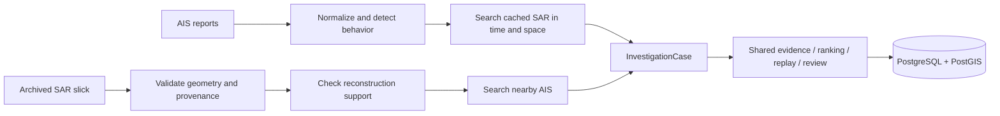

# Architecture

The browser uses one same-origin `/api` gateway in Next.js. FastAPI checks the session and role for every protected request. PostgreSQL stores normalized trajectories as timestamped JSON, track LineStrings, observation MultiPolygons, investigation cases, reviews and audit events. PostGIS performs anomaly-window spatial searches and WGS84 geography-area measurements. Python calculates ranking, geodesic replay positions and the illustrative transport ensemble.

AIS-first searches within 100 km and ±24 hours of individual anomaly locations and times. Missing matches produce a needs-evidence case rather than oil confirmation. SAR-first starts from a cached observation, explicitly records the missing reconstruction inputs and exposes available candidate AIS. Historical cases never include synthetic trajectories; training cases use only synthetic trajectories. Both triggers are idempotent for the same seed input and mode.

No workers, queues, Kafka, microservices or cloud infrastructure are needed. A single-process API is appropriate for this local prototype. Source files and source checksums are retained. Existing observation records are immutable through the application; reviews use version checks to prevent overwriting concurrent decisions.

## Access policy

| Operation | Anonymous/public | Authority | Admin |
|---|---:|---:|---:|
| Published historical archive and geometry | Yes | Yes | Yes |
| Internal cases, candidates, replay and export | No | Yes | Yes |
| Detection, review and exercise transport | No | Yes | Yes |
| Users, roles, AIS import and audit overview | No | No | Yes |

A client-supplied role is ignored. Private cases have no static/public copy. Cookies contain an opaque random session token; the database stores only its SHA-256 digest. User roles and active state are checked on every request, with immediate session revocation on role change. Admins cannot change their own role or remove the last active administrator through the API. Login is throttled per direct client address for this single-process local deployment. HTTPS and secure cookies must be configured before any nonlocal deployment.

This application is deliberately local-only. It is not a hardened public production deployment. See limitations for remaining security work.

## Account creation and independent replay

`POST /api/admin/authorities` requires an admin session and a matching Origin. It validates name/email/password, normalizes email, rejects unknown fields (including requested roles), stores an Argon2 hash, assigns the authority role on the server and audits creation without the password. Duplicate email returns 409. New accounts use the existing session/RBAC flow. Administrators choose and share initial credentials directly; no invitation email service is introduced.

`GET /api/tracks`, `/api/tracks/{id}`, and `/api/tracks/{id}/replay?at=...` require authority or admin access. They provide standalone replay without fabricating an InvestigationCase or implying source attribution. Admin AIS imports appear in this library when it is reopened. Public archive endpoints never return trajectory data. The recording pack remains entirely local.
